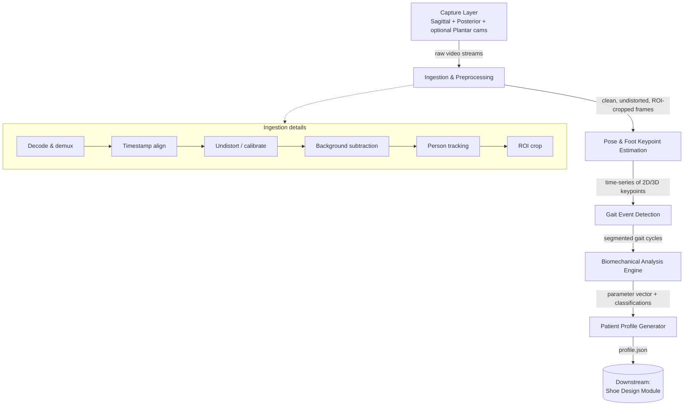
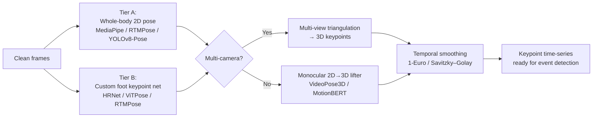
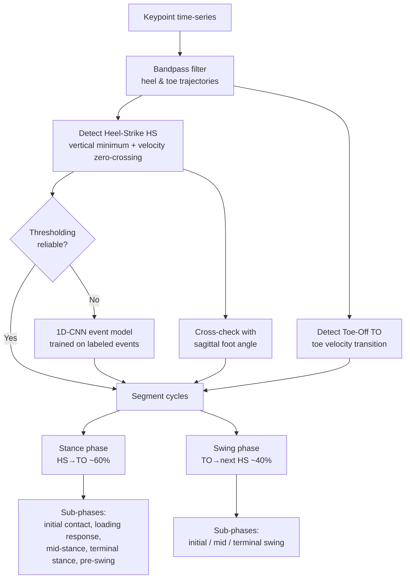
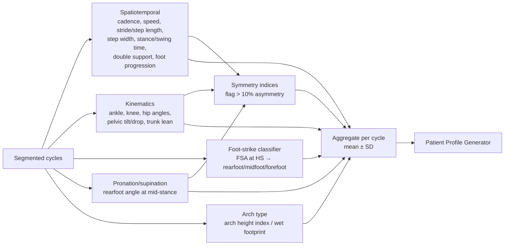
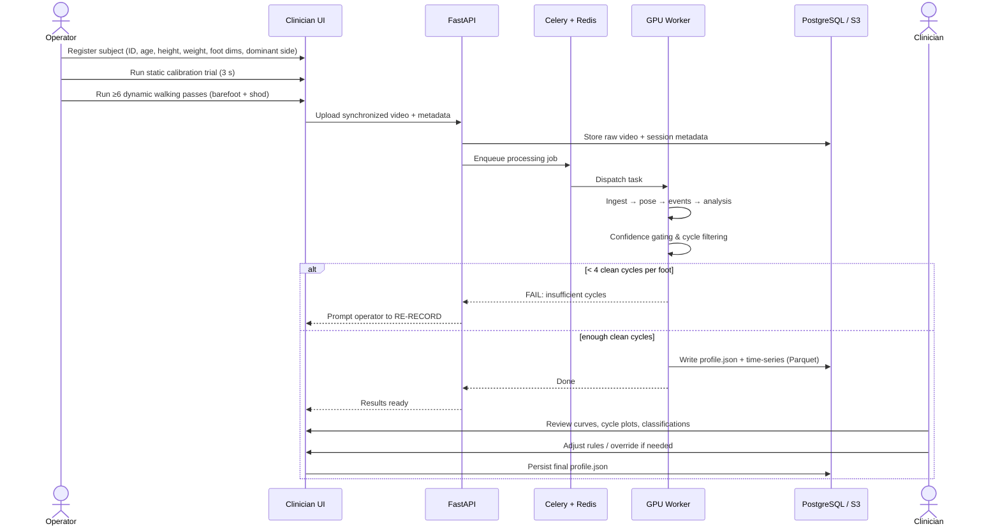
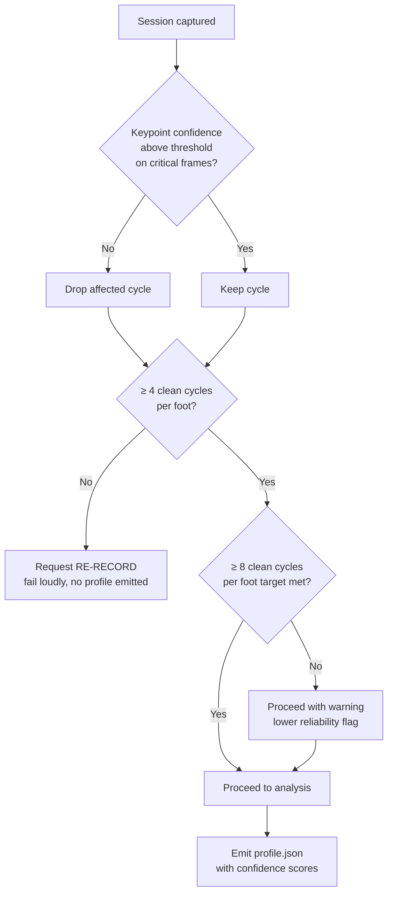
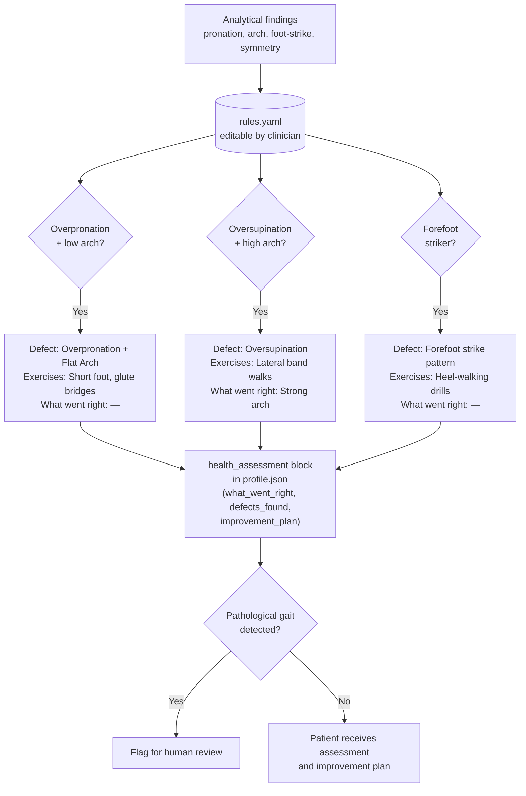
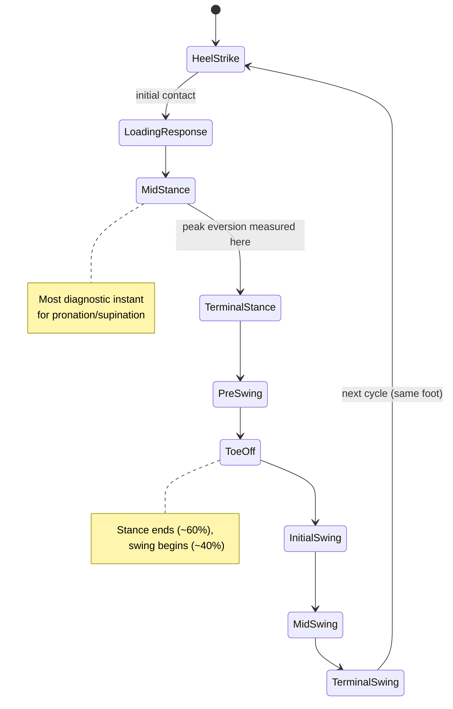
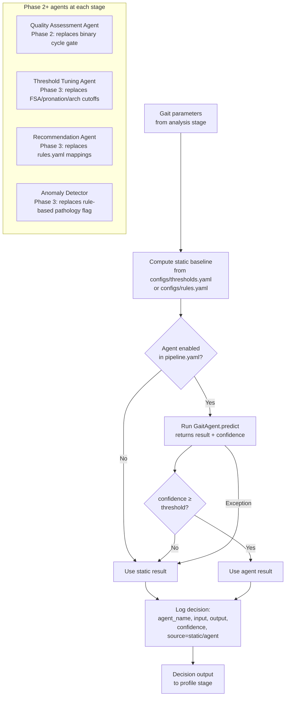
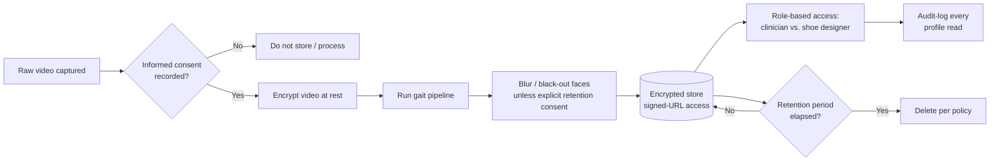

# Data Flow & Diagrams
## Gait Analysis Module — Visual Flows

| Field | Value |
|---|---|
| Document | Data Flow & Diagrams |
| Version | 1.0 |
| Format | Mermaid (renders in GitHub, VS Code with Mermaid extension, Obsidian, etc.) |
| Related | [ARCHITECTURE.md](./ARCHITECTURE.md), [DATA_CAPTURE_PROTOCOL.md](./DATA_CAPTURE_PROTOCOL.md) |

> If a diagram does not render in your viewer, paste the code block into <https://mermaid.live>.

---

## 1. End-to-end pipeline (data flow)

---

## 2. Pose & keypoint estimation (two-tier strategy)

---

## 3. Gait event detection & cycle segmentation

---

## 4. Biomechanical analysis fan-out

---

## 5. Session sequence (operator → system → output)

---

## 6. Quality-gating decision flow

---

## 7. Health assessment rule mapping (YAML-driven)

---

## 8. Gait cycle state machine

---

## 9. AI agent decision flow (Phase 2+)

Every decision point that currently uses static YAML thresholds is designed to optionally route through an AI agent. The static baseline is always computed first; the agent result is used only when enabled and high-confidence.

**Key invariant:** removing the entire `agents/` module produces identical pipeline behavior (static baseline path always exists).

---

## 10. Data lifecycle (capture → storage → privacy)

