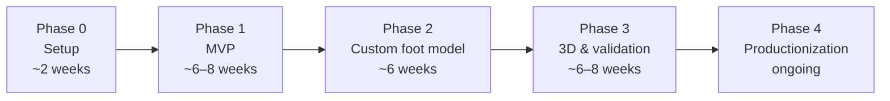
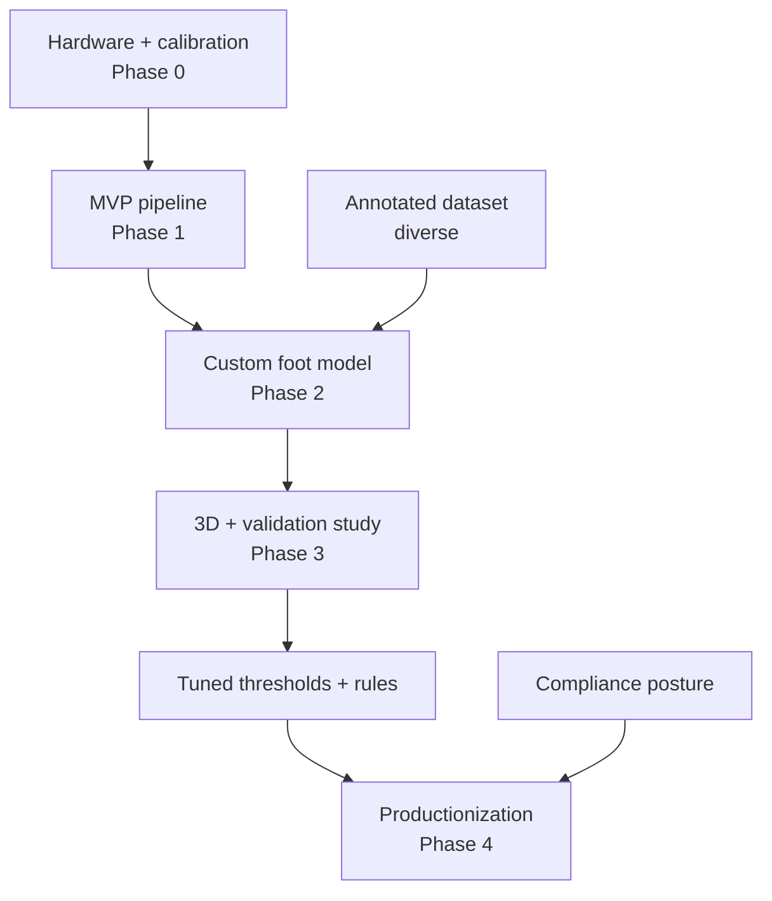

# Phased Roadmap
## Gait Analysis Module — Delivery Plan

| Field | Value |
|---|---|
| Document | Roadmap |
| Version | 1.0 |
| Related | [PRD.md](./PRD.md), [ARCHITECTURE.md](./ARCHITECTURE.md), [VALIDATION_QA.md](./VALIDATION_QA.md) |

Durations are **indicative**. Each phase has explicit deliverables and **exit criteria** — do not start the next phase until the current one's exit criteria are met.

---

## Phase overview

| Phase | Duration | Theme |
|---|---|---|
| **Phase 0 — Setup** | ~2 weeks | Hardware, walkway, calibration |
| **Phase 1 — MVP** | ~6–8 weeks | End-to-end pipeline with off-the-shelf pose |
| **Phase 2 — Custom foot model** | ~6 weeks | Annotation + fine-tuned foot detector |
| **Phase 3 — 3D & validation** | ~6–8 weeks | Multi-view 3D + validation study |
| **Phase 4 — Productionization** | ongoing | Hardening, compliance, monitoring |

---

## Phase 0 — Setup (~2 weeks)

**Deliverables**
- Hardware procured: cameras, mounts, sync rig, lighting.
- Walkway built (≥ 6 m, matte, ~1 m wide, ≥ 500 lux).
- Calibration scripts (intrinsic + extrinsic) working.
- Repo scaffolding per [PROJECT_STRUCTURE.md](./PROJECT_STRUCTURE.md); CI green on an empty pipeline.
- ✅ **AI agent infrastructure:** `src/gait/agents/` directory with `base.py` (GaitAgent ABC); `pipeline.yaml` has `agents:` section (all disabled). Ready for Phase 2+.

**Exit criteria**
- [ ] All three (or two for MVP) cameras synced and calibrated.
- [ ] A test capture can be recorded and stored.
- [ ] Undistortion and scale verified on a test frame.
- [ ] `src/gait/agents/base.py` exists; `pipeline.yaml` has `agents.enabled: false`.

---

## Phase 1 — MVP (~6–8 weeks)

**Scope:** sagittal + posterior cameras; off-the-shelf pose; rule-based events; the core metrics; JSON output; a simple viewer.

**Deliverables**
- Ingestion & preprocessing (decode, undistort, background subtract, track, ROI).
- Tier-A pose via **MediaPipe**.
- Rule-based heel-strike / toe-off detection + cycle segmentation.
- Spatiotemporal parameters + pronation classification.
- `profile.json` output validated against `profile/v1`.
- Simple **Streamlit/React** viewer (curves + classifications).
- **All thresholds and rules in YAML** — no hardcoded decision logic; every decision point exposes a `confidence` score and logs its reasoning (training data for Phase 2 agents).

**Exit criteria**
- [ ] A captured session produces a schema-valid `profile.json`.
- [ ] Pronation classification and spatiotemporal params populate correctly.
- [ ] Re-record gating works (< 4 clean cycles/foot → no profile).
- [ ] Processing completes within the time budget on the reference machine.
- [ ] Barefoot vs. shod comparison viewable.
- [ ] Every pipeline decision logged with `confidence` and `reasoning` fields.

---

## Phase 2 — Custom foot model + Quality Agent (~6 weeks)

**Scope:** replace weak off-the-shelf foot points with a dedicated, fairer detector; deploy the first AI agent.

**Deliverables**
- Annotation pipeline + labeling guidelines (`data_pipeline/`).
- **~3k images labeled** for foot keypoints (calcaneus, malleoli, MTP heads, hallux, mid-Achilles).
- Dataset intentionally diverse: **Indian foot morphology, skin tones, lighting**.
- Fine-tuned **RTMPose/HRNet** foot detector with a `MODEL_CARD.md`.
- Improved rearfoot-angle accuracy wired into the pipeline.
- **Quality Assessment Agent (v1):** trained on Phase 1 session data; replaces the binary `< 4 cycles → reject` gate with a continuous confidence score. Reduces false-negative re-record requests.
  - Input: gait cycle keypoints + metadata
  - Output: `quality_score` (0–1) + issue flags
  - Fallback: binary gate (unchanged if agent disabled or low-confidence)

**Exit criteria**
- [ ] Foot-keypoint localization error below target on a held-out diverse test set.
- [ ] No systematic accuracy drop across skin-tone subgroups.
- [ ] Rearfoot-angle accuracy measurably improved vs. Phase 1.
- [ ] Quality Assessment Agent accuracy ≥ static baseline on held-out sessions.
- [ ] Agent override rate logged and < 20% (clinician agreement high).

---

## Phase 3 — 3D, validation & learning agents (~6–8 weeks)

**Scope:** add 3D reconstruction, prove clinical accuracy, deploy threshold/recommendation/anomaly agents.

**Deliverables**
- Multi-view **triangulation** (or monocular 2D→3D lift where single-camera).
- **Pressure-mat validation study, n ≈ 30 subjects** (barefoot + shod, simultaneous capture).
- Bland–Altman + ICC analysis vs. ground truth.
- Tightened thresholds in `configs/thresholds.yaml`.
- Finalized shoe-recommendation rules in `configs/rules.yaml`.
- **Threshold Tuning Agent:** learns optimal FSA / pronation / arch cutoffs from pressure-mat ground truth; replaces hardcoded YAML thresholds.
- **Recommendation Agent:** trained on Phase 2 clinician overrides; replaces/augments static `rules.yaml` mappings.
- **Anomaly Detector:** learns pathological patterns from diverse validation cohort; sets `needs_human_review` instead of the rule-based flag.
- All three agents validated vs. static baseline before deployment; fairness checks per subgroup.

**Exit criteria**
- [ ] ICC > 0.85 vs. ground truth on headline metrics.
- [ ] Repeatability: rearfoot-angle SD < 2°, stance-time SD < 5%.
- [ ] Thresholds and rules re-tuned from study data and signed off by the orthotist.
- [ ] Each Phase 3 agent accuracy ≥ its static YAML baseline.
- [ ] No systematic agent accuracy drop across skin-tone/morphology subgroups.
- [ ] Agent model cards written (`models/agents/*.MODEL_CARD.md`).

---

## Phase 4 — Productionization + online learning (ongoing)

**Deliverables**
- API hardening (auth, RBAC, rate limits, error handling).
- Clinician dashboard polish (gait curves, side-by-side cycles, 3D skeleton overlay).
- Full compliance posture per [PRIVACY_COMPLIANCE.md](./PRIVACY_COMPLIANCE.md) (consent, encryption, signed URLs, audit logging, retention).
- Monitoring/observability (per-stage timings, confidence drift, dropped-cycle and override rates, **per-agent override rates**).
- Quarterly foot-model drift review process in place.
- **Online learning loop:** collect clinician overrides + patient follow-up data; retrain agents quarterly; A/B test new vs. old before deploy.
- Agent governance dashboard: confidence trends, override rates, fairness metrics per subgroup.
- Orchestration path to Kubernetes when throughput requires it.

**Exit criteria (steady state)**
- [ ] Compliance checklist fully satisfied.
- [ ] Monitoring dashboards live with alerting (including agent metrics).
- [ ] Documented agent retraining/drift-review cadence running (quarterly).
- [ ] Agent A/B testing and approval workflow in place.

---

## Cross-phase dependencies

---

## Definition of done (prototype)
Per [PRD.md §12](./PRD.md): given 6 walking passes, return within ~60 s a `profile.json` with spatiotemporal parameters, pronation/supination classification (with confidence), foot-strike pattern, arch type, symmetry assessment, and a first-pass shoe-design recommendation block — the single contract with the rest of the footwear system.
